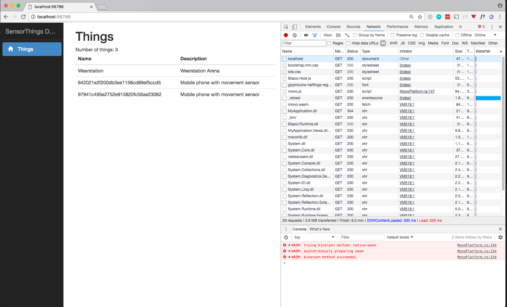

# blazor_test



Getting started:

```
$ git clone https://github.com/bertt/blazor_test.git
$ cd src
$ dotnet restore
$ dotnet run

Using launch settings from /Users/bert/dev/git/bertt/blazor_test/src/Properties/launchSettings.json...
Hosting environment: Development
Content root path: /Users/bert/dev/git/bertt/blazor_test/src
Now listening on: http://localhost:56786
Application started. Press Ctrl+C to shut down.
```

Now in browser go to http://localhost:56786 to open site
